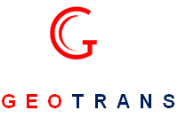

<head>
<link  rel="stylesheet" style type="text/css" href="css/main.css" />
</head>

“GEOTRANS” is a project planning, engineering and management consulting firm to deliver services for integrated infrastructure  development. Established in Noida in the year 2017 as a multi disciplinary organization with capabilities and resources to bring best of global engineering solutions.

\

<blockquote id="bq_error"> 
Our aim is to be recognized as amongst  best consulting firm in transportation & Infrastructure sector in India for delivering  sustainable engineering solutions (SES)  while adding value to the client
</blockquote> 

\

Our current area of service includes transport planning, highways, bridges, airports, railways, mass rapid transit system, ports, urban planning, building & structures, hydropower, water resources, public health and environment engineering. Our experienced team, in-depth technical knowledge, technology expertise & trusted strategic partners put us ahead in delivering projects to meet or exceed client’s requirement. we are “united to deliver” sustainable engineering solutions to the nation for society and to all peoples. 

We believe in building trust and network of relationship through business. We strive to do better with continuous learning , passion for engineering and through business excellence. We feel proud to be an engineer and our focus is to collaborate with clients to help them meet targets and enhancing their business value.  Our action is to attain sustainable business, aligned with clients need, maintaining a competitive edge, developed a niche market, build strong brand value, offering value engineering and develop a strong client relationship. 

\

\