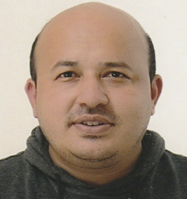
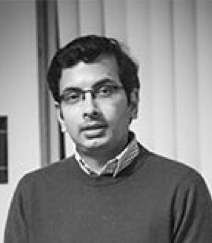

\
\

<h4> <b> Mitesh Singh Chauhan </b> </h4>
<h5> <b> Project Director, Roads and Higways </b> </h5>
<h5> B.E Civil, M.E- Transportation, EPGD- Int. Business </h5>
Mitesh Singh Chauhan holds Master degree in the field of Transportation Engineering and Executive Post Graduate Diploma in International Business. He has over `r as.integer((difftime(Sys.Date(), as.Date("2003-04-01"), unit="weeks"))/52.25)` years  of pure consultancy experience in the field of transportation engineering with diversified project experience ranging from roads, urban roads, expressways, national highways, railways, metro, hydro project and urban projects. As a design lead in various leading organisation, he has delivered various challenging infrastructure projects across India and Middle East involving multi-disciplinary team approach for the integrated design delivery. His project expertise includes infrastructure planning, application of international design practices, value engineering, detailed design using design software, concept preparation, at grade junction design, Interchange design, roundabout design, bypass / realignment study, pre bid advisory service, road safety audit, contract documentation and due diligence.

\
\

<h4> <b> Srirama Bhamidipati </b> </h4>
<h5> <b> Associated Project Director, Traffic and Transport </b> </h5>
<h5> B.E Civil, M.E- Transportation, M.E - Urban Planning </h5>

Srirama Bhamidipati  has over `r as.integer((difftime(Sys.Date(), as.Date("2003-04-01"), unit="weeks"))/52.25)` years of vast experience of delivering national and international projects including association in research work in Netherlands and Vietnam. He is associated on project basis with GeoTrans. He has delivered some of the prestigious and challenging transportation engineering projects across India, Africa and Europe. He specializes in transport modelling, traffic simulation, spatial analysis, GIS simulations. His area of interest includes asset management and climate change impacts on infrastructure assets. He has sound knowledge of ESRI ArcGIS Desktop products specializing in geo processing and spatial analysis. He is also an active contributor to development of agent-based simulation platform - GAMA.

\
\
\
\
